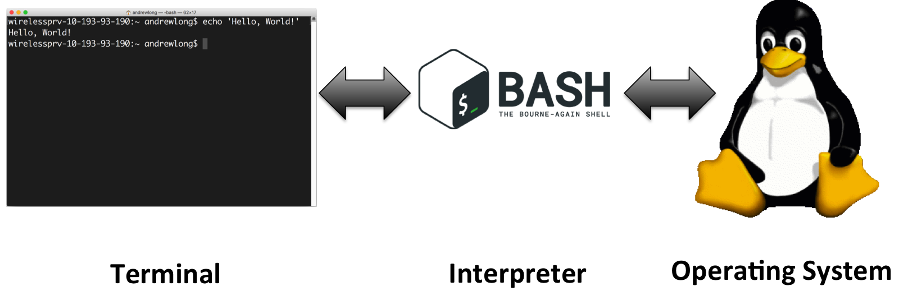

# Bourne-Again: Intro to BASH and Scripting
====================

## What is BASH? What does it do? ##
Key terminology (simplified):

* OS: operating system, what actually does the work under the hood, manages running tasks
* Terminal: A text input/output environment, translates keyboard strokes into text, handles text display on the screen
* Shell: a command-line interpreter, handles text input from the terminal and converts it into code to be run by the OS



The Bourne-Again SHell (BASH) is a particular shell environment, developed as a successor to the Bourne shell (SH) written by Steven Bourne. BASH is one of the most popular flavors of shell, though many alternatives exist (zsh, tcsh, ksh, ...). All of them have slightly different syntax, but they function the same: serve as an mediator between the user acting on a terminal and the OS.

## Why should I learn BASH? ##

1. **Prevalence:** It's absolutely everywhere, if you're interested in scientific computing you're pretty much guaranteed to need to work with a Unix or Linux system at some point, and BASH is your portal to working with these systems.
2. **Utility:** BASH offers a wide range of features and functions to interact with file systems and the OS
3. **Scriptable:** can automate tasks that would be difficult or tedious to do with only a graphical interface

## Starting up ##

To access a BASH environment, we need to use some kind of terminal application. Everyone has their favorite (I like [iTerm2](https://www.iterm2.com/) on OSX and [Terminator](http://gnometerminator.blogspot.com/p/introduction.html) on Linux), but on Linux/OSX there will be a default terminal:


If you're on Windows, you'll need a terminal program (I've been told there's a bash app now in [Windows 10](https://msdn.microsoft.com/en-us/commandline/wsl/about)). Back before then, there were a few different options, you could dual boot Linux on your machine, or you could use [PuTTY](http://www.putty.org/), a terminal app, to connect to a remote Linux machine. For those on an older version of Windows, you can use PuTTY to access the campus engineering workstations (EWS) while on campus (or through VPN):

```
Hostname: <NetID>@remlnx.ews.illinois.edu
```

If other folks running Linux/OSX like to work on the EWS system, you can run the following command in your own terminals:

```
ssh <NetID>@remlnx.ews.illinois.edu
```

The `ssh` command standards for secure shell, a network protocol for connecting your terminal to a remote shell application. Just a note: I find it super slow to run on the EWS system. If you can do things locally/on another system then it might be a better option.

## Hello, Bash! ##

Opening a new terminal window will start a new instance of your default shell. We can type commands or arbitrary text into this terminal, and send them to the BASH interpreter for processing. Because every language (yes, BASH is a fully functioning language!) needs their own 'Hello World' example, here's the simple way in BASH. Note: the `$` symbol is how we establish that we are currently sending commands to the shell from a terminal. I've also seen other terminal characters like `>`, but for the purposes of this tutorial, `$ commands` will indicate sending bash shell commands directly in the terminal. 

```
$ echo Hello, Bash!
Hello, Bash!
```

While this quick test shows how easy it is, there's a lot going on under the hood. First, the terminal window takes your keyboard input and displays it to the screen. Upon pressing a carriage return, the full line of text is passed from the terminal to the shell, which parses that text input. The shell parses out the `echo` command, which says take the block of characters following this command, and pass it directly back to the terminal window (*echoing the input*).

## File System Navigation ##

### Commands ###

* `pwd` - get the path for the (p)resent (w)orking (d)irectory
* `ls` - list contents of current directory
* `cd <path>` - change directory to \<path\>

Often one of the first things you'd like to know when you start a new instance of BASH is what directory are you currently working in. To do this, we'll use the `pwd` command. This will give the full path to the current working directory.

> A **directory** is similar to the notion of a folder in a graphical desktop environment, it contains a list of files and subdirectories. The file system can be conceptualized as a tree of directories.


(http://docstore.mik.ua/orelly/unix/lrnunix/ch03_01.htm)

> A **path** is a location of a directory or file from the root directory `/`, you can think of it as the names of the folders you traversed to get to that directory/file. Relative paths are listed from the current directory, and are not started with a `/` symbol. Absolute paths are given from the root directory `/`.

If we'd like to look at the contents of our current directory, we can use the `ls` command. This will return a lexicographically sorted list of all files and subdirectories present. Under the hood, `ls` is actually equivalent to `ls .`, calling for a list of files in the `.` current directory. If we'd like the files in an alternate directory, we can look at them directly using `ls <path>`. There are tons of extra flags we can pass to `ls`, but I'll list only the two that I think are useful to know (see: <http://linuxcommand.org/man_pages/ls1.html>):

* `ls -lh` - list contents of directory in long (`-l`), human-readable (`-h`) form (includes data on file size/access date/permissions)

Knowing the contents of a directory, it's time we were able to move between directories. To do this, we will use the `cd` command. We hand `cd` a path we would like to move to, either relative to our current directory or absolute. Using the example directory tree above, if `pwd` returns `/users/john`, we could `cd work` or `cd /users/john/work/` to access our work folder.

### Special directories ###
* `.` - the current directory
* `..` - the directory above `.` in the tree
* `~` - a user's home directory (usually `/home/<UserName>/` or `/users/<UserName>/`)
* `/` - root directory of the file system

## File System Manipulation ##

### Commands ###

* `cp <source> <destination>` - copy file from source to destination
* `mv <source> <destination>` - move file from source to destination
* `rm <filepath>` - delete file specificied by path
* `mkdir <path>` - make a new directory at path
* `rmdir <path>` - remove the directory at path

Examples:

`cp Readme.md ../Readme.old.md` takes the current `Readme.md` file and copies it to the previous directory in the tree, modifying the name of the file to `Readme.old.md`

`mv AllMyData.csv Backup/` will move the file to the folder `Backup` in the current working directory, maintaining the same file name.

`rm ~/Downloads/UnhelpfulReviewersComments.pdf` will remove the file from the Downloads folder in the user's home directory.

`mkdir ~/Backups/DailyBackup_090716` will create a new folder in the `Backups` directory inside of home

`rmdir Projects/WhatWasIThinking` will remove the folder `WhatWasIThinking` from the current directories `Projects` folder. NOTE: this folder must be empty otherwise you will get an error (there are ways around this but it's safer until you are more comfortable with bash scripting to only remove empty folders, otherwise you risk destroying your system)

## File Access##

### Commands ###

* `cat <filepath1> <filepath2> ...` - concatenate all of the contents of all passed files and print them to the screen
* `less <filepath>` - interactive file browser, allows you to scroll through a file without opening it/dumping the full contents to screen
* `head <filepath>` - grab the first 10 lines of a file
* `tail <filepath>` - grab the last 10 lines of a file
	* `head` and `tail` can be passed a `-n #` to print the first/last # lines
* `grep <pattern> <filepath>` - search for pattern in file and print lines that contain the pattern

Two other important operators to know, redirect to file:

* `>` - redirect data that would be printed to the terminal into a file, this function OVERWRITES the file if it exists
	*  Example: `head -n 12 dataFile.dat > dataHeader.dat`
*  `>>` - redirect data but APPEND it to the file if it already exists


### Piping data from one command to another ###
An example from molecular simulation: we have a data file that contains the positions of a large number of L3K peptides (L=LEU=Leucine, K=LYS=Lysine, column 1).

```
$ cat after_nvt.gro
Martini system from L3K.pdb
21923
    1LEU     BB    1   1.213   1.987   1.343  0.2643  0.0428 -0.1789
    1LEU    SC1    2   1.272   1.746   1.562  0.2976  0.1963 -0.0951
    2LEU     BB    3   1.499   2.231   1.279 -0.0785 -0.1063 -0.3216
    2LEU    SC1    4   1.479   2.473   1.052 -0.1779  0.2060  0.0329
    3LEU     BB    5   1.796   2.187   1.456  0.2418  0.1456  0.2937
    3LEU    SC1    6   1.757   1.860   1.596 -0.1554 -0.1429 -0.1564
    4LYS     BB    7   2.091   2.225   1.579 -0.0849  0.0039  0.1769
    4LYS    SC1    8   2.242   1.917   1.541 -0.1881 -0.1178 -0.2775
    4LYS    SC2    9   2.190   1.638   1.403  0.0037  0.0082 -0.1669
    1LEU     BB   10   1.034   2.095   5.004  0.2386 -0.2658 -0.1759
    ...
```

Luckily this file has a very static description. I'd like to know the coordinates of all of the LYS backbone groups (BB, column 2), with x/y/z coordinates stored between characters 21 and 44 (inclusive). I'd like to write these coordinates to a separate file, LYS\_BB\_Coords.dat. We can do this pretty easily by passing data between bash commands. To do this, we use a pipe `|`, which takes output from one command and passes it to another

```
$ cat after_nvt.gro | grep 'LYS' | grep 'BB' | cut -c21-44 >> LYS_BB_Coords.dat'
$ head LYS_BB_Coords.dat
   2.091   2.225   1.579
   1.917   1.997   5.165
   2.164   1.502   8.733
   1.412   2.512  12.128
   1.944   4.958   1.097
   2.091   5.480   4.924
   1.366   5.163   9.381
   1.273   5.310  12.140
   1.916   9.112   1.614
   2.121   8.803   4.956
```

Note: `awk` is a powerful, powerful tool, that I do NOT have time to go into sadly (this entire thing could've been a one-liner in `awk`). If you need to parse columns out of files, do yourself a favor and spend some time looking into it. (<http://www.tutorialspoint.com/awk/>)


### Looking at files ###
In lieu of starting a war, I will only suggest that there are a wide variety of possible file editors that you might pick from:

* vi/vim
* emacs
* gedit
* nano
* pico
* atom
* textedit
* jed
* ...

Each has their own pros and cons, and each of these could be their own separate talk so I'll leave it there.

## Scripting! ##

So far we've learned how to use BASH to move around and look at a file system, and extract information from files. The nice part about bash is that we can write small scripts, or sequences of bash commands stored in a file, and use those to do our work instead of having to use the same sets of commands over and over again. Running a script opens up a new BASH environment, and runs the scripted commands in that environment.

### Running a bash script ###

There are multiple different options for running a script. The easiest is to just pass your script file to the bash interpreter and let it run:

`bash myScript.sh` 

Typically people use the file extension `.sh` for shell scripts to be clear, though this is not required. An alternative technique is to give the script executable (`+x`) permissions using the change file modes (`chmod`) command. Once the file has been given execute permissions, it can be called from the terminal without invoking the bash command directly.

```
chmod +x myScript.sh
./myScript.sh
```

In this case, it can be useful to have the following line at the beginning of your script file to ensure that the interpreter correctly parses your shell script for bash:

`#!/bin/bash`

### Shell Script Special Characters ###

* `$?` - what was the return call of the last command executed in the shell
* `$#` - how many command line arguments were passed to the script
* `$1`, `$2`, ... - the values of the command line arguments, in their given order (`$1` is the first argument, etc)
* `$0` - the name of the currently run shell script
* `$@` - array containing all of the `($1, $2, ...)` variables

### Setting variables/math! ###

Let's say I would like to run some python analysis code on my data, and I'd like to make it easy on myself so that I can make changes quickly or be uniform with my variables across different pools of data. We can write a small bash script to run our code for us, handling things like taking in the data file from the command line arguments, setting up analysis parameters, passing those to a python function call, and pushing the data to output files. All with only a few lines of bash scripting!

```
#!/bin/bash

# set variables
datafile=$1 # passed argument parameter
script="analyzeSim.py" # string
columns=(4  5  6) # array
starttime=1000 # integers
difftime=100
# run script
python $script $datafile $starttime ${columns[*]] ${columns[0]} >> outStart.txt
# 
endtime=$((starttime+difftime))
python $script $datafile $endtime ${columns[*]] ${columns[0]} >> outEnd.txt

```

There are a number of things here to note

* `varname=...` sets the value of a variable, this works for strings, integers, and arrays. The lack of whitespace is important (won't work if there are spaces)
* We call these variables with `$varname`
* For an array, `$varname` will give the first element (index 0) in the array.
	* Single element access is given by `${varname[number]}`
	* All elements are given by `${varname[*]}`
* We can do (integer) arithmetic with the `$(( ))` construct on our set variables.
	* The standard `+ - * / %` operators all work in this way
	* Bitwise operators also work: `& | ^ << >> ! ~`


### Conditionals ###

BASH conditionals take a bit of getting used to if you're coming from most other languages. Here's the basic structure of an `if` statement, 

```
if CONDITIONAL_STATEMENT
then
	# perform true action
else
	# perform false action
fi
```

Conditional operators are slightly different than in other languages, but luckily we can take advantage of the _extended test command_ `[[ ]]` which will take our condition statement and parse it like pretty much any other language. There are a variety of other options here, including `(( ))` and `[ ]`, but we'll stick with the extended test command for this tutorial.

**NOTE: In BASH, return values of 0 are considered true, return values of non-zero are considered false. This is related to the idea of program return codes: a 0 indicates everything finished as expected, all other values indicate some form of error/extraneous result. This is very different from most other languages.** 

With that caveat in place, you can use most of your favorite conditional statements in BASH inside `[[ ]]`. Note the extra spacing below, it is necessary so that the bash shell can correctly parse the statement.

* Equality checking: `[[ $a == $b ]]` or `[[ $a != $b ]]`
* Greater than/less than: `[[ $a > $b ]]` or `[[ $a < $b ]]`
* Logical AND: `[[ $a > $b && $c > $b ]]`
* Logical OR: `[[ $a > $b || $c > $b ]]`
* Single command versions of greater than or equal/less or equal can be done via the `-ge` or `-le` operators, `[[ $a -ge $b ]]`

Some extra fun ones for strings/file paths:

* Is string empty/null (zero length): `[[ -z $str ]]`
* Is string NOT empty: `[[ -n $str ]]`
* Does a file/directory exist: `[[ -e $path ]]`
* Is the string a valid directory: `[[ -d $path ]]`
* Is the string a valid file: `[[ -f $path ]]`

### Loops ###

The standard `for` loop in bash follows the same convention as in _C_, you define a loop counter that starts at some value, you have a test condition for when to end the loop, and you define some adjustment to your loop counter on each iteration. Here's a simple example to print numbers, skipping by 5, from START to END:

```
START=0
END= 100
for ((counter = $START; counter <= $END; counter+=5))
do
	echo $counter
done
```

Similarly, `while` loops follow a very normal structure, and here's how you'd do the printing statement from above:

```
counter=$START
while [[ $counter -le $END ]]
do
	echo $counter
	counter=$((counter+5))
done
```

If you've got an array, you can also do a loop through each element, similar to a `for each` loop:

```
arr=`seq $START 5 $END` # defining an array
for i in $arr
do
	echo $i
done
```

### Writing and calling functions ###

Sometimes you'll find that you end up writing the same set of operations in your script, and you'd like to condense your code for readability/make things simpler on your self. Well you can define functions in a bash file like any other language! A simple examples that prints out all input arguments to a function would be:

```
printArgs()
{
	for i in $@
	do
		echo $i
	done
}
```

## Example script: Prime Number Factorization ##

Let's work through an example script that takes in a number argument from the command line and prints out the prime factorization of that number. This script will demonstrate the use of functions, loops, conditional statements, and recursion.

First, we need to know if a number `N` is prime. A simple means of testing this is to check if any number `i`, where `i <= sqrt(N)`, divides evenly into `N`. For this, we'll use the modulo operator `N % i` (this operator returns the remainder from performing division `N/i`, if the result is 0 then `N` is perfectly divisible by `i`).

Let's write up a function for deciding if a number is prime based on this idea:

```
isPrime()
{
	# local modifies variable scope so we don't overwrite elsewhere
	local N=$1
	local i
	for ((i = 2; $((i*i)) <= $N; i++))
	do
		if [[ $((N%i)) == 0 ]]
		then
			return 1
		fi
	done
	return 0
}
```

Next we'll hunt for the prime factors of our number. The idea is to iterate from a starting number until we find a prime number `p`. Once we find one, we should check to see if it's a factor of `N`:

* If `p` is a prime factor of `N`, we should output `p` and then start the search process over again, now looking at the number `N/p` and starting at `p`.
* If `p` is NOT a prime factor of `N`, we should continue searching for prime factors of `N` starting at `p+1`

Let's try to do this then with recursion:

```
findPrimeFactor()
{
	local N=$1
	START=$2
	if isPrime $N # takes in the return code of the function
	then
		printf "%d" $N
		return
	fi

	local p
	for ((p = $START; $((p*p)) <= $N; p++))
	do
		if isPrime $p
		then 
			if [[ $((N%p)) == 0 ]]
			then
				printf "%dx" $p
				N=$((N/p))
				findPrimeFactor $N $p
				return
			fi
		fi
	done
}
```

And that's it! We now have a function that can take in a number and get out the prime factorization, let's generate out the rest of the script to handle user inputs. In particular, I'd like to handle the case where the user hands multiple numbers to the program to factorize:

```
for i in $@
do
	printf "Prime Factors of %d: " $i
	findPrimeFactor $i 2 # start with the smallest prime value
	printf "\n"
done
```

And just for a little bit of fun:

```
$ time ./primeFactorize.sh 210745829136131
Prime Factors of 210745829136131:601x350658617531

real   	0m7.830s
user   	0m7.372s
sys    	0m0.457s
```

There are more efficient techniques out there but our little bash script could factor a 14-digit number in ~8 seconds. Not too shabby!